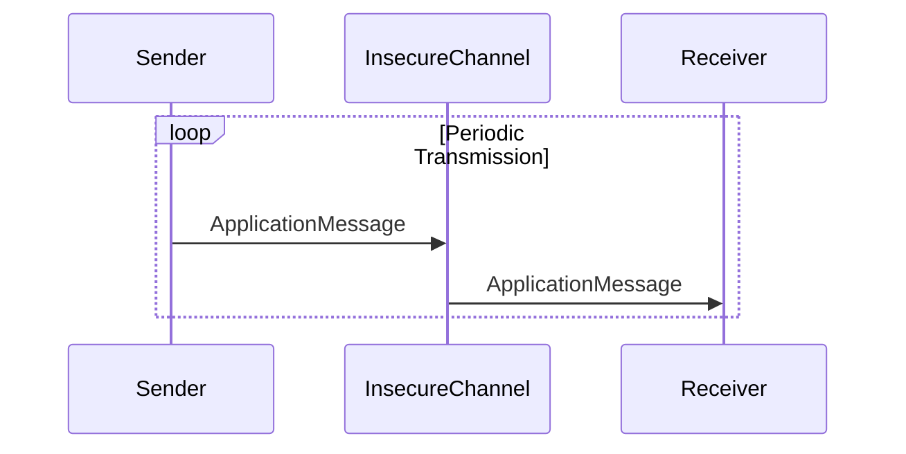

# Didactic Example: Secure Key Exchange with Insecure Periodic Communication

## 1. Purpose and Scope

This document formally describes a didactic communication example consisting of two peers:

- **Sender**
- **Receiver**

The example intentionally separates:

- a **secure, authenticated key-exchange phase**, and
- an **insecure, periodic data-exchange phase**

in order to illustrate *why* cryptographic key exchange must be protected by a secure channel, while subsequent communication **is not**.

This is an educational example and **must not** be interpreted as a production-ready security design.

---

## 2. System Overview

### 2.1 Components

| Component | Description |
|---------|-------------|
| Sender | Initiates key exchange and periodically transmits application data |
| Receiver | Responds to key exchange and processes periodic data |
| Secure Channel | Assumed trusted channel used **only** during key exchange |
| Insecure Channel | POSIX message queues used for periodic communication |
| Cryptographic Library | Botan (used for randomness and key material handling) |

### 2.2 Trust Assumptions

- The secure channel **guarantees confidentiality, integrity, and authenticity**.
- The insecure channel **provides no security guarantees**.
- Attackers may observe, replay, or inject messages on the insecure channel.

---

## 3. Communication Phases

The protocol consists of two strictly separated phases:

1. **Secure Key Exchange Phase** (one-time, protected)
2. **Periodic Communication Phase** (repeated, unprotected)

```
Time ─────────────────────────────────────────►

[ Secure Channel ]  Key Exchange (once)
[ Insecure Channel ] Periodic Messages (repeated)
```

---

## 4. Secure Key Exchange Phase

### 4.1 Objective

The goal of the key exchange phase is to establish shared cryptographic material between Sender and Receiver.

Key characteristics:

- Executed exactly once at startup
- Performed exclusively over a **secure channel**
- Resistant to eavesdropping and manipulation

### 4.2 Cryptographic Properties

- Cryptographically secure random number generation
- Explicit message identifiers
- Deterministic state transitions

### 4.3 Sequence Diagram



### 5.4 Threat Model for Periodic Communication

#### 5.4.1 Attacker Capabilities

The attacker is assumed to have full control over the insecure channel used during the periodic communication phase.

| Capability | Availability |
|-----------|--------------|
| Passive eavesdropping | ✅ |
| Message injection | ✅ |
| Message modification | ✅ |
| Message replay | ✅ |

The attacker **cannot**:

- Observe or interfere with the secure key exchange channel
- Break cryptographic primitives
- Compromise Sender or Receiver endpoints

#### 5.4.2 Consequences

| Attack | Consequence |
|------|-------------|
| Eavesdropping | Disclosure of periodic application data |
| Injection | Receiver processes attacker-crafted messages |
| Modification | Silent corruption of application data |
| Replay | Receiver cannot distinguish stale messages |

No attack during the periodic phase compromises the secrecy or integrity of the previously exchanged key material.

### 5.5 Academic-Style Protocol Specification (Periodic Phase)

#### Participants

- \( S \): Sender
- \( R \): Receiver

#### Channel

- \( C_i \): Insecure, unauthenticated channel

#### Protocol Definition

For each discrete time interval \( t \):

- \( S 
ightarrow R : M_t \) over \( C_i \)

where \( M_t \) is transmitted in plaintext without cryptographic protection.

#### Security Properties

The periodic communication phase provides:

- No confidentiality guarantees for \( M_t \)
- No integrity guarantees for \( M_t \)
- No authenticity guarantees for \( M_t \)

#### Explicit Non-Properties

The protocol phase explicitly does not claim:

- Replay protection
- Ordering guarantees
- Session semantics

---

## 5. Periodic Communication Phase

### 5.1 Objective

After key exchange, the system enters a periodic communication loop.

Key characteristics:

- Uses **POSIX message queues**
- No encryption, authentication, or replay protection
- Intended to demonstrate insecurity

### 5.2 Message Properties

| Property | Value |
|--------|-------|
| Confidentiality | ❌ None |
| Integrity | ❌ None |
| Authenticity | ❌ None |
| Replay Protection | ❌ None |

### 5.3 Sequence Diagram


---

## 6. Security Analysis

### 6.1 Intentional Weaknesses

This example **intentionally allows** the following attacks during periodic communication:

- Message interception
- Message modification
- Message injection
- Message replay

These weaknesses exist to reinforce the lesson that **secure key exchange alone does not secure communication**.

### 6.2 Educational Takeaway

> A secure key exchange does **not** imply secure communication.

Security must be applied:

- at the **correct phase**, and
- on the **correct channel**.

---

## 7. Non-Goals

The following are explicitly **out of scope**:

- End-to-end encryption of periodic messages
- Authentication of periodic messages
- Forward secrecy guarantees
- Production-grade error handling

---

## 8. Conclusion

This didactic example demonstrates a common security pitfall: assuming that a secure initialization phase automatically protects subsequent communication.

By clearly separating:

- a **secure key exchange**, and
- an **insecure operational phase**

this example provides a concise teaching tool for protocol and system security design.

---

## 9. Disclaimer

This software and documentation are provided **for educational purposes only**.

Do **not** reuse this design in real-world systems.

